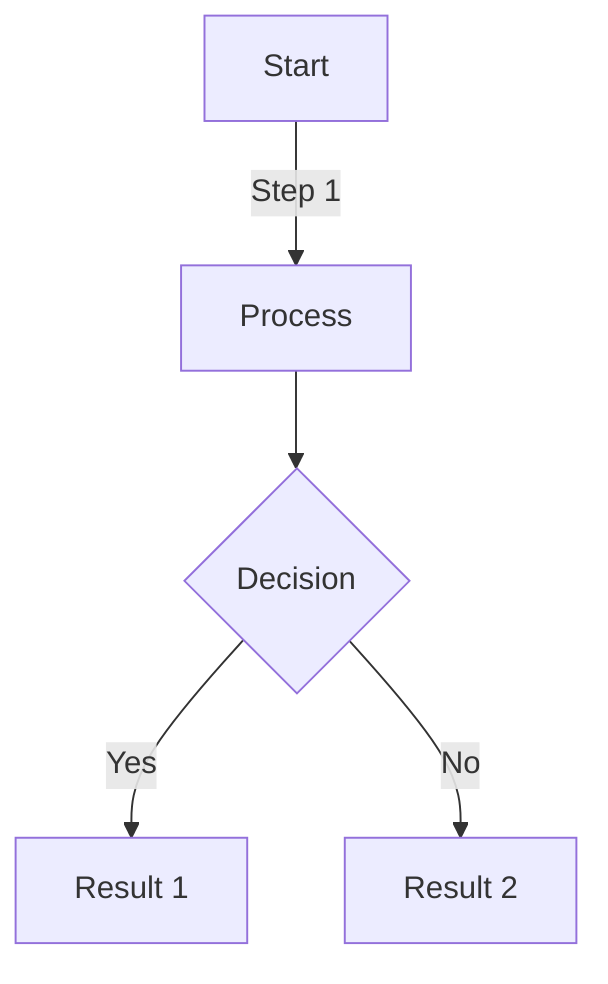
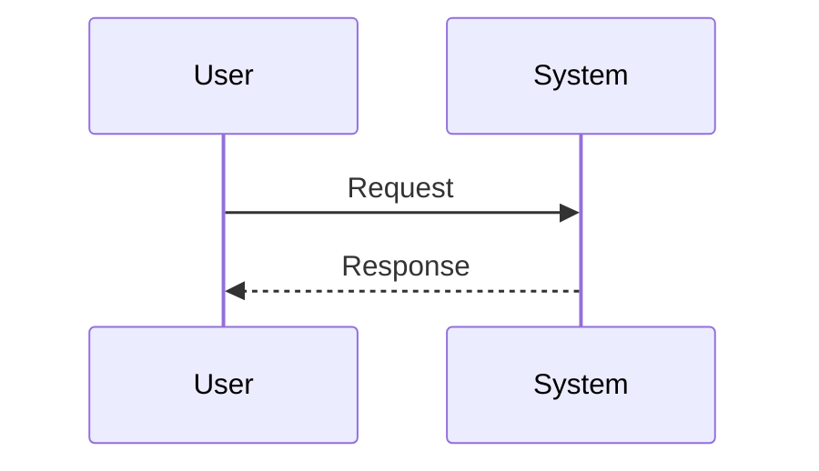
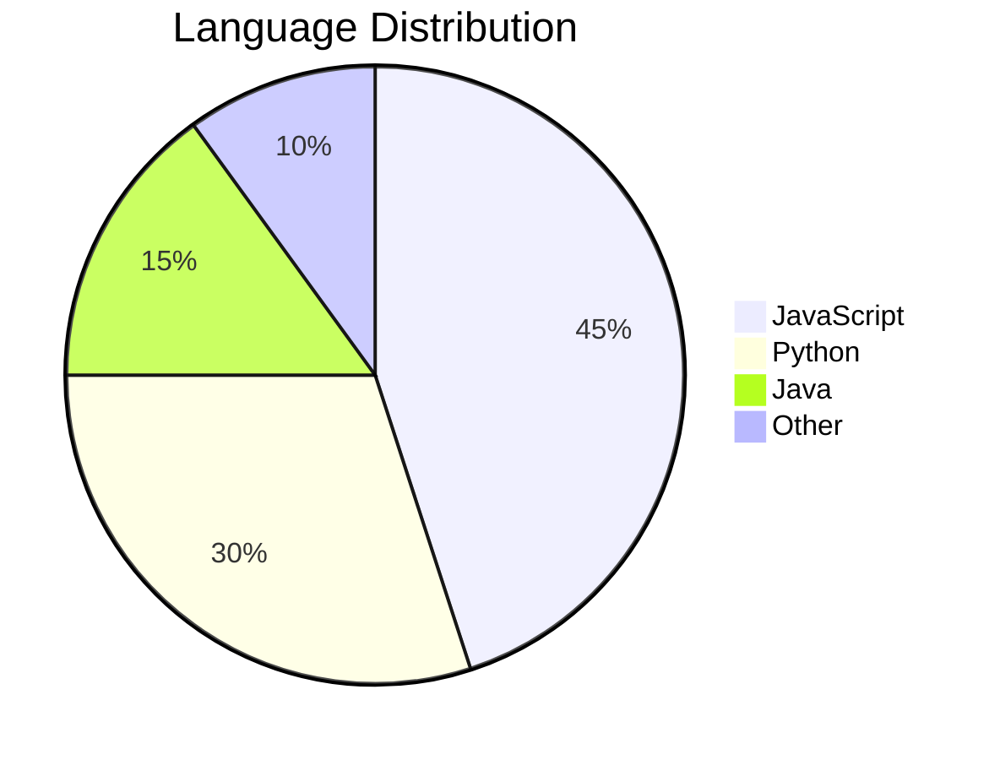

# Ultimate GitHub Markdown Reference

A comprehensive showcase of every GitHub Markdown feature.

## Table of Contents
- [Headings](#headings)
- [Text Formatting](#text-formatting)
- [Lists](#lists)
- [Links](#links)
- [Images](#images)
- [Code](#code)
- [Tables](#tables)
- [Blockquotes](#blockquotes)
- [Advanced Features](#advanced-features)

---

## Headings

# H1 Heading
## H2 Heading
### H3 Heading
#### H4 Heading
##### H5 Heading
###### H6 Heading

Alternative H1
=============

Alternative H2
-------------

## Text Formatting

**Bold text** or __bold text__

*Italic text* or _italic text_

***Bold and italic*** or ___bold and italic___

~~Strikethrough text~~

<sub>Subscript text</sub>

<sup>Superscript text</sup>

**Bold with _nested italic_**

*Italic with **nested bold***

You can also use <ins>underlined text</ins> with HTML

<mark>Highlighted text</mark> (may not work in all renderers)

## Lists

### Unordered Lists

- Item 1
- Item 2
  - Nested item 2.1
  - Nested item 2.2
    - Deeply nested item 2.2.1
- Item 3

* Alternative bullet
* Another bullet
  * Nested alternative

+ Plus sign bullet
+ Another plus bullet

### Ordered Lists

1. First item
2. Second item
   1. Nested item 2.1
   2. Nested item 2.2
3. Third item

### Task Lists

- [x] Completed task
- [x] Another completed task
- [ ] Incomplete task
- [ ] Another incomplete task
  - [x] Nested completed task
  - [ ] Nested incomplete task

### Definition Lists (using HTML)

<dl>
  <dt>Term 1</dt>
  <dd>Definition of term 1</dd>
  <dt>Term 2</dt>
  <dd>Definition of term 2</dd>
</dl>

## Links

[Inline link](https://github.com)

[Link with title](https://github.com "GitHub Homepage")

[Reference-style link][reference-id]

[reference-id]: https://github.com "GitHub Reference"

<https://github.com> - Automatic link

[Relative link to file](./README.md)

[Link to section](#headings)

You can also use [relative links][relative] and [reference links with numbers][1].

[relative]: ./docs/guide.md
[1]: https://github.com

## Images


![Reference-style image][logo]

[logo]: https://via.placeholder.com/100 "Logo"

### Image with link

[](https://github.com)

### Image sizing (using HTML)


### Image alignment (using HTML)

<p align="center">
  
</p>

## Code

### Inline Code

Use `inline code` with backticks.

Use `` `backticks` `` to show backticks inside code.

### Code Blocks

```
Plain code block
No syntax highlighting
```

#### JavaScript
```javascript
function greet(name) {
  console.log(`Hello, ${name}!`);
  return true;
}
```

#### Python
```python
def greet(name):
    print(f"Hello, {name}!")
    return True
```

#### HTML
```html
<!DOCTYPE html>
<html>
<head>
  <title>Example</title>
</head>
<body>
  <h1>Hello World</h1>
</body>
</html>
```

#### CSS
```css
.container {
  display: flex;
  justify-content: center;
  align-items: center;
}
```

#### Bash/Shell
```bash
#!/bin/bash
echo "Hello, World!"
ls -la
```

#### JSON
```json
{
  "name": "example",
  "version": "1.0.0",
  "dependencies": {
    "package": "^1.0.0"
  }
}
```

#### Diff
```diff
function addNumbers(a, b) {
-  return a + b;
+  return a + b + 1;
}
```

## Tables

### Basic Table

| Header 1 | Header 2 | Header 3 |
| -------- | -------- | -------- |
| Cell 1   | Cell 2   | Cell 3   |
| Cell 4   | Cell 5   | Cell 6   |

### Aligned Columns

| Left Aligned | Center Aligned | Right Aligned |
| :----------- | :------------: | ------------: |
| Left         | Center         | Right         |
| Text         | Text           | Text          |

### Table with Formatting

| Name | Description | Status |
| ---- | ----------- | ------ |
| **Bold** | *Italic* | ~~Strike~~ |
| `Code` | [Link](https://github.com) | ✅ Done |

### Complex Table

| Feature | Syntax | Example |
| ------- | ------ | ------- |
| Bold | `**text**` | **bold** |
| Italic | `*text*` | *italic* |
| Code | `` `code` `` | `code` |
| Link | `[text](url)` | [GitHub](https://github.com) |

## Blockquotes

> Simple blockquote

> Multi-line blockquote
> continues here
> and here

> Nested blockquote
>> Second level
>>> Third level

> Blockquote with **formatting**
> - Lists work too
> - Another item
>
> ```javascript
> // Code blocks work
> console.log('Hello');
> ```

## Horizontal Rules

Use three or more hyphens, asterisks, or underscores:

---

***

___

- - -

## Advanced Features

### Emoji

:smile: :heart: :thumbsup: :rocket: :fire: :sparkles:

You can also use Unicode emoji directly: 😀 ❤️ 👍 🚀 🔥 ✨

### Mentions

@username mentions a user (renders as link on GitHub)

### Issue References

#123 references issue number 123

GH-123 also references issue 123

username/repository#123 references another repo's issue

### Commit References

Full SHA: 1234567890abcdef1234567890abcdef12345678

Short SHA: 1234567

### Footnotes

Here's a sentence with a footnote[^1].

Here's another with a longer footnote[^bignote].

[^1]: This is the first footnote.
[^bignote]: This is a longer footnote with multiple paragraphs.

    You can indent paragraphs to include them in the footnote.

### Collapsed Sections (Details/Summary)

<details>
<summary>Click to expand!</summary>

### Hidden content

This content is hidden by default.

- You can use Markdown here
- Lists work
- **Formatting** works too

```javascript
// Even code blocks!
console.log('Surprise!');
```

</details>

<details>
<summary>Another collapsed section</summary>

More hidden content here.

</details>

### Escaping Characters

Use backslash to escape Markdown characters:

\*Not italic\* \[Not a link\] \# Not a heading

### Comments

<!-- This is a comment and won't be rendered -->

[//]: # (This is also a comment)

### Keyboard Keys

Use `<kbd>` tags for keyboard keys:

Press <kbd>Ctrl</kbd> + <kbd>C</kbd> to copy

<kbd>⌘ Cmd</kbd> + <kbd>V</kbd> to paste

### Mathematical Expressions (GitHub LaTeX)

Inline math: $E = mc^2$

Block math:

$$
\frac{n!}{k!(n-k)!} = \binom{n}{k}
$$

$$
\int_{-\infty}^{\infty} e^{-x^2} dx = \sqrt{\pi}
$$

### Diagrams (Mermaid)







### GeoJSON

```geojson
{
  "type": "FeatureCollection",
  "features": [
    {
      "type": "Feature",
      "geometry": {
        "type": "Point",
        "coordinates": [-122.4, 37.8]
      }
    }
  ]
}
```

### TopoJSON

```topojson
{
  "type": "Topology",
  "objects": {
    "example": {
      "type": "GeometryCollection",
      "geometries": []
    }
  }
}
```

### STL 3D Models

```stl
solid cube
  facet normal 0 0 1
    outer loop
      vertex 0 0 1
      vertex 1 0 1
      vertex 1 1 1
    endloop
  endfacet
endsolid
```

### Alerts/Callouts (GitHub-specific)

> [!NOTE]
> Useful information that users should know, even when skimming content.

> [!TIP]
> Helpful advice for doing things better or more easily.

> [!IMPORTANT]
> Key information users need to know to achieve their goal.

> [!WARNING]
> Urgent info that needs immediate user attention to avoid problems.

> [!CAUTION]
> Advises about risks or negative outcomes of certain actions.

### Color Swatches

GitHub renders color hex codes with swatches:

- `#0969DA` - Blue
- `#FF0000` - Red
- `rgb(9, 105, 218)` - RGB Blue
- `hsl(212, 92%, 45%)` - HSL Blue

### HTML Elements

GitHub supports many HTML elements:

<div align="center">
  <strong>Centered and bold text</strong>
</div>

<table>
  <tr>
    <td>HTML Table</td>
    <td>With cells</td>
  </tr>
</table>

<br>

Line breaks with `<br>`

<hr>

<p>Paragraphs with <code>&lt;p&gt;</code> tags</p>

### Line Breaks

End a line with two spaces  
to create a line break.

Or use a backslash\
for line breaks.

Or use HTML `<br>` tags.<br>
Like this.

---

## Combining Features

You can combine multiple Markdown features:

| Feature | Example | Result |
| ------- | ------- | ------ |
| **Bold in table** | `**text**` | **text** |
| *Italic with [link](https://github.com)* | `*[link](url)*` | *[link](https://github.com)* |
| ~~Strike with `code`~~ | `~~`code`~~` | ~~`code`~~ |

> **Note:** This blockquote contains:
> - A list
> - With `inline code`
> - And [a link](https://github.com)
> 
> ```javascript
> // And a code block!
> const combined = true;
> ```

---

## Special Characters

### Automatic Conversion

GitHub automatically converts:

- (c) → ©
- (r) → ®
- (tm) → ™
- Arrows: --> → → and <-- → ←
- "Smart quotes" → "Smart quotes"
- Three dots... → …

### Emojis Shortcuts

GitHub supports hundreds of emoji codes:

:octocat: :shipit: :+1: :-1: :100: :heavy_check_mark: :x:

:computer: :book: :bulb: :mag: :pencil2: :memo:

---

## Tips and Tricks

1. **Preview Mode**: Always preview your Markdown before committing
2. **Line Length**: Keep lines under 80-120 characters for readability
3. **Blank Lines**: Use blank lines to separate elements for clarity
4. **Consistency**: Choose one style for bullets (-, *, +) and stick with it
5. **Accessibility**: Always include alt text for images

---

**Last Updated**: 2025

**License**: MIT

**Contributing**: PRs welcome!

---

Made with :heart: and Markdown

---
# Badges


